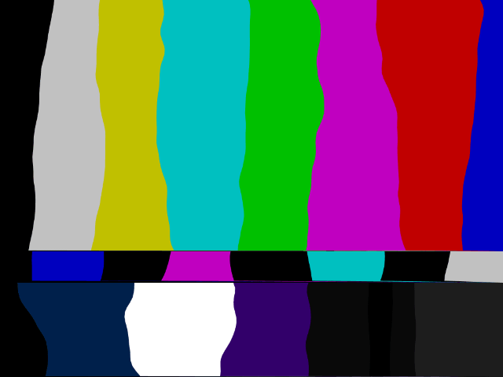
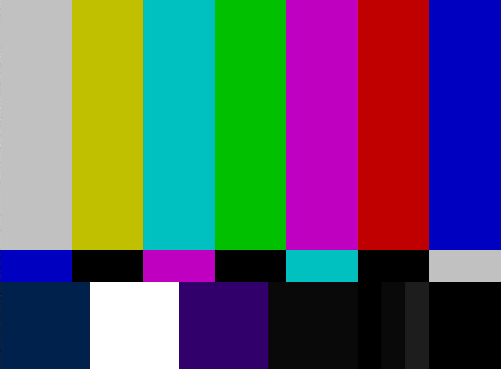

# SMPTE Tunning Color Bars

## Goal

The main goal of this project is to simulate tunning SMPTE Color bars in processing
using Perlin Noise instead of sinusoidal lines to show up something like in this
[SMPTE Tunning Video on Youtube](https://www.youtube.com/watch?v=GaqYKpsQCOo)

## Steps
1. smpte_static

2. Perlin noise horizontal
3. Perlin noise vertical
4. SMPTE Color Bars Tunning

## TODO
[ ] Create the list of node points as a map so that all bars are moving accordingly
[ ] Fix the buggy start of vertical lines !IMPORTANT
[ ] Your contribution ... 
